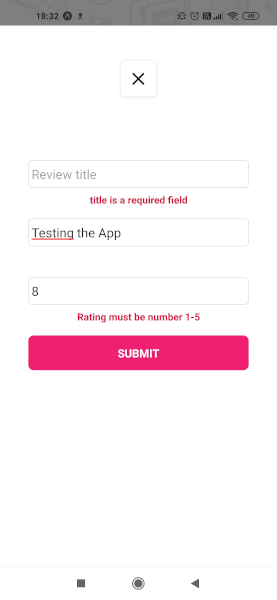

**Coding a React-Native GameReview App**

 

> Use new React-Native components like ImageBackground or Modal.
>
> Manipulate Stack-Navigation and Draw-Navigation.
>
> Create Form with Formik and Improve validation with Yup.
>
> Testing mobile rendering with Expo App or Virtual Android.

 

Special Thx to [The Net Ninja](https://www.youtube.com/channel/UCW5YeuERMmlnqo4oq8vwUpg) 😉

 

 &ensp; &ensp;  &ensp; &ensp;  &ensp; &ensp;  &ensp; &ensp;
